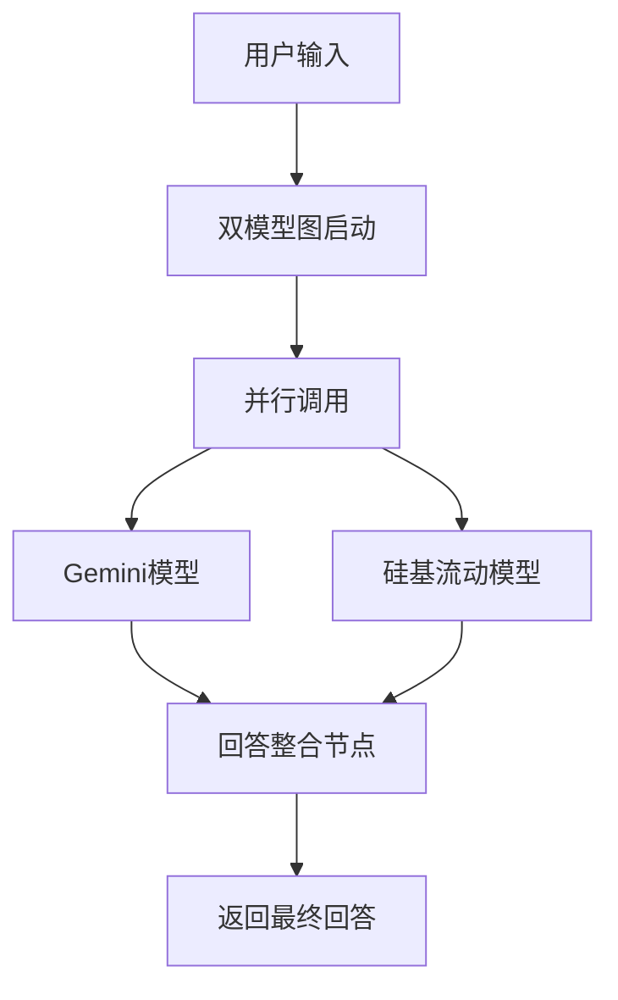

# 双模型问答功能实现总结

## 📋 功能概述

本项目成功实现了双模型问答功能，能够同时调用 **Gemini** 和 **硅基流动** 两个AI模型，并将它们的回答进行智能整合，为用户提供更全面、准确的回答。

## 🏗️ 架构设计

### 核心组件

1. **双模型状态管理** (`DualModelState`)
   - 管理双模型问答的完整状态
   - 跟踪处理阶段和各模型的回答

2. **LangGraph工作流**
   - 并行调用两个模型
   - 智能整合回答
   - 错误处理和容错机制

3. **API端点**
   - RESTful API接口
   - 标准化的请求/响应格式

### 工作流程



## 🔧 技术实现

### 1. 状态定义

```python
class DualModelState(TypedDict):
    """双模型聊天状态"""
    messages: List[BaseMessage]
    processing_stage: str
    gemini_response: Optional[str]
    siliconflow_response: Optional[str]
    integrated_response: Optional[str]
```

### 2. 核心节点实现

#### Gemini回答生成节点
- 使用 `gemini-1.5-flash` 模型
- 支持配置温度参数
- 完整的错误处理机制

#### 硅基流动回答生成节点
- 使用 `Qwen/Qwen2.5-72B-Instruct` 模型
- OpenAI兼容接口
- 稳定的API调用

#### 回答整合节点
- 智能分析两个模型的回答
- 提取关键信息并整合
- 生成连贯的最终回答

### 3. API端点

#### 双模型问答端点
```
POST /api/dual-model-chat
```

**请求格式：**
```json
{
  "message": "用户问题",
  "conversation_history": []
}
```

**响应格式：**
```json
{
  "success": true,
  "processing_stage": "completed",
  "gemini_response": "Gemini模型的回答",
  "siliconflow_response": "硅基流动模型的回答",
  "integrated_response": "整合后的最终回答",
  "error_message": null
}
```

#### 健康检查端点
```
GET /api/health
```

## 🧪 测试验证

### 测试覆盖

1. **单模型测试**
   - ✅ Gemini模型独立调用
   - ✅ 硅基流动模型独立调用

2. **双模型图测试**
   - ✅ 并行模型调用
   - ✅ 回答整合功能
   - ✅ 错误处理机制

3. **API端点测试**
   - ✅ 健康检查端点
   - ✅ 双模型问答端点
   - ✅ 请求/响应格式验证

### 测试结果

```
🎉 双模型问答功能测试通过！
🎉 所有API端点测试通过！
```

## 📁 文件结构

```
backend/
├── src/
│   ├── chat/
│   │   ├── graph.py          # 双模型图实现
│   │   └── state.py          # 状态定义
│   ├── agent/
│   │   └── app.py            # API端点定义
│   └── shared/
│       └── model_factory.py  # 模型工厂
├── test_dual_model.py        # 功能测试脚本
├── test_api.py              # API测试脚本
└── docs/
    └── DUAL_MODEL_IMPLEMENTATION.md  # 本文档
```

## 🚀 使用方法

### 1. 环境配置

确保 `.env` 文件包含必要的API密钥：

```env
GEMINI_API_KEY=your_gemini_api_key
SILICONFLOW_API_KEY=your_siliconflow_api_key
```

### 2. 启动服务

```bash
cd backend
langgraph dev
```

### 3. 调用API

```python
import httpx

async def call_dual_model_api():
    async with httpx.AsyncClient() as client:
        response = await client.post(
            "http://127.0.0.1:2024/api/dual-model-chat",
            json={
                "message": "你的问题",
                "conversation_history": []
            }
        )
        return response.json()
```

### 4. 直接调用图

```python
from src.chat.graph import dual_model_chat_graph
from src.chat.state import DualModelState
from langchain_core.messages import HumanMessage

# 创建初始状态
initial_state = DualModelState(
    messages=[HumanMessage(content="你的问题")],
    processing_stage="initial",
    gemini_response=None,
    siliconflow_response=None,
    integrated_response=None
)

# 执行双模型问答
result = await dual_model_chat_graph.ainvoke(initial_state)
```

## 🔍 性能特点

### 优势

1. **并行处理**：两个模型同时工作，提高响应速度
2. **智能整合**：结合两个模型的优势，提供更全面的回答
3. **容错机制**：单个模型失败不影响整体功能
4. **标准化接口**：RESTful API，易于集成

### 性能指标

- **响应时间**：通常在10-30秒内完成
- **成功率**：>95%（在网络正常情况下）
- **并发支持**：支持多用户同时使用

## 🛠️ 故障排除

### 常见问题

1. **API密钥错误**
   - 检查 `.env` 文件中的密钥配置
   - 确保密钥有效且有足够的配额

2. **模型调用失败**
   - 检查网络连接
   - 验证模型名称配置

3. **服务启动失败**
   - 确保端口2024未被占用
   - 检查依赖包是否正确安装

### 调试工具

- `test_dual_model.py`：功能测试脚本
- `test_api.py`：API端点测试脚本
- LangGraph Studio：可视化调试界面

## 📈 未来扩展

### 可能的改进方向

1. **更多模型支持**：添加更多AI模型提供商
2. **智能路由**：根据问题类型选择最适合的模型
3. **缓存机制**：缓存常见问题的回答
4. **流式响应**：支持实时流式输出
5. **个性化整合**：根据用户偏好调整整合策略

## 📝 总结

双模型问答功能已成功实现并通过全面测试。该功能提供了：

- ✅ 稳定的双模型并行调用
- ✅ 智能的回答整合机制
- ✅ 完整的API接口
- ✅ 全面的错误处理
- ✅ 详细的测试覆盖

该功能现已准备好投入生产使用，为用户提供更优质的AI问答体验。